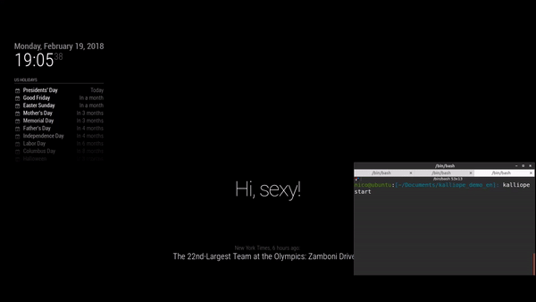

# MMM-kalliope

Module to bind [Kalliope](https://github.com/kalliope-project/kalliope) with your Magic Mirror.

This module allow you to:
- show what Kalliope say on the screen
- control your Magic Mirror by sending notification to other active modules

> **Note:** On Kalliope, [a neuron is available](https://github.com/kalliope-project/kalliope_neuron_magic_mirror) to talk with this module directly.



[Video demo with sound here](https://youtu.be/QHwctPbJ2ZY)

## Installation

Clone this repo into `~/MagicMirror/modules` directory.

Configure your `~/MagicMirror/config/config.js`:

```js
{
    module: "MMM-kalliope",
    position: "upper_third",
    config: {
        title: "Kalliope"
    }
}
```

## Configuration option

| Option       | Default  | Description                                                                                                |
|--------------|----------|------------------------------------------------------------------------------------------------------------|
| max          | 5        | How many messages should be keept on the screen.                                                           |
| keep_seconds | 5        | Number of seconds received messages will stay displayed. If set to "0", then message will never be removed |
| title        | Kalliope | The name placed above received messages                                                                    |

## API documentation

#### POST /kalliope/

Query parameters

| Parameter    | Description                                                                                                                                               |
|--------------|-----------------------------------------------------------------------------------------------------------------------------------------------------------|
| notification | The notification identifier. If set to "KALLIOPE", the payload will be printed by the module. In other case the notification is sent to all other modules |
| payload      | A notification payload to pass to the module. Can use plain text or JSON.                                                                                 |

## Curl examples

This command will send a message that will be printed by the MMM-kalliope module
```
curl -H "Content-Type: application/json" -X POST -d '{"notification":"KALLIOPE", "payload": "my message"}' http://localhost:8080/kalliope
```


Here the notification is sent to the alert module.
```
curl -H "Content-Type: application/json" -X POST -d '{"notification":"SHOW_ALERT", "payload": {"title": "mytitle", "message": "this is a test", "timer": 5000}}' http://localhost:8080/kalliope
```
